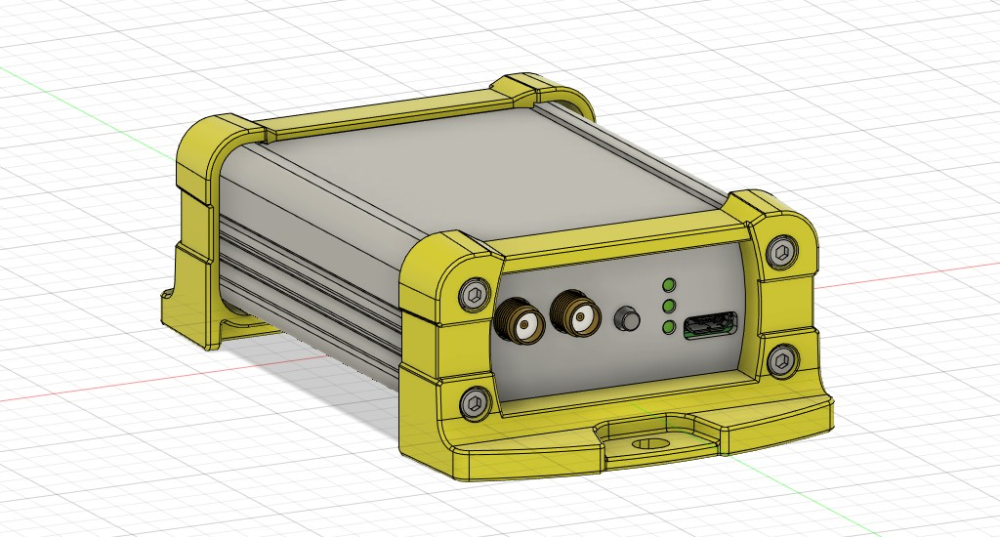

# mosaic-Board
## Introduction
- **mosaic-Board** = [**mosaic**](https://github.com/septentrio-gnss/mosaicHAT) + **micro SD card** + **Ethernet** + **Case**
- We use [Septentrio's mosaic-X5](https://www.septentrio.com/en/products/gnss-receivers/rover-base-receivers/receivers-module/mosaic) GNSS module which is a **low-cost** and **survey-grade** GNSS receiver
- This project is inspired by [mosaicHAT](https://github.com/septentrio-gnss/mosaicHAT) and extends it further. Thanks to the wonderful project [mosaicHAT](https://github.com/septentrio-gnss/mosaicHAT)!
- License: [Creative Commons Attribution Share-Alike License](https://creativecommons.org/licenses/by-sa/4.0/). and [Open Source HW](https://www.oshwa.org/definition/)  
 
 

## Features
- The mosaic-Board has a RJ45 LAN connector and can easily distribute GNSS reference station data over the Internet without a PC by using mosaic's built-in Ntrip Caster or Ntrip Server.
- The micro SD card enables use as a GNSS logger without a PC.

## Board
- The design of the board is based on the original [mosaicHAT](https://github.com/septentrio-gnss/mosaicHAT).
  - RJ45 connector has been added
  - Micro SD card and log button have been added for data logging capability
- [KiCAD files](./board/KiCAD) and [gerber](./board/gerber)
- Bill of Materials (BOM) is [here](./board/BOM.xlsx)                                 
  

## Case
- Metal case design data (Fusion 360, STEP) is [available](./case)
 