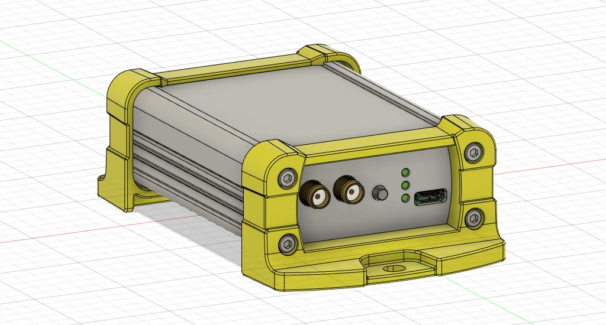
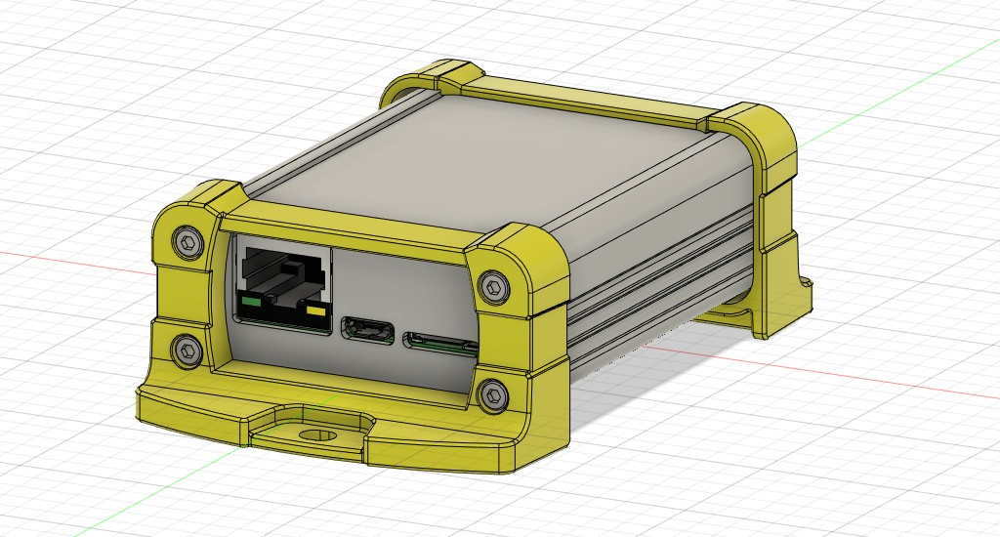

# mosaic-Board Case
## Case
- TAKACHI EXP7-3-9, EXPE7-3-9, EXPF7-3-9 or EXEF7-3-9 
  - **EXP7-3-9** https://www.takachi-enclosure.com/products/EXP
  - **EXPE7-3-9** https://www.takachi-enclosure.com/products/EXPE (EMC shield)
  - **EXPF7-3-9** https://www.takachi-enclosure.com/products/EXPF (with flanged frame)
  - **EXEF7-3-9** https://www.takachi-enclosure.com/products/EXEF (EMC shield with flanged frame)
  
  
- Metalworking of the panel is required.

## 3D data
- `Fusion360/mosaicBoard-case.f3z`: Fusion 360 design data
- `mosaicBoard-case.step`: STEP file
- `panel1.step`: Panel STEP file
- `panel2.step`: Panel STEP file